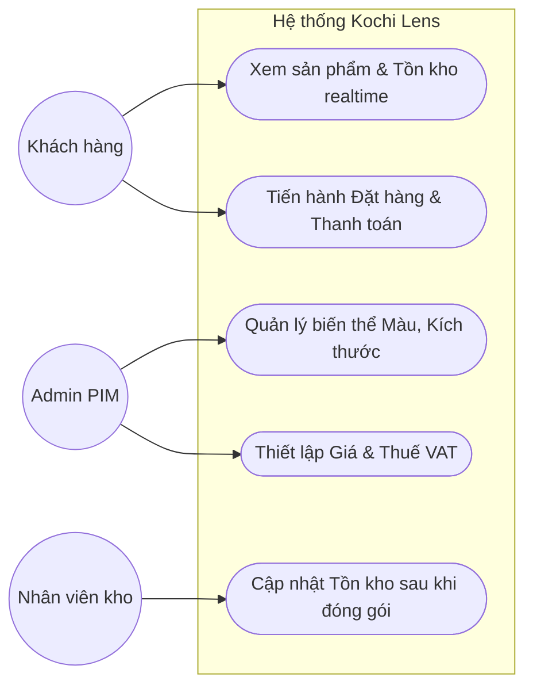
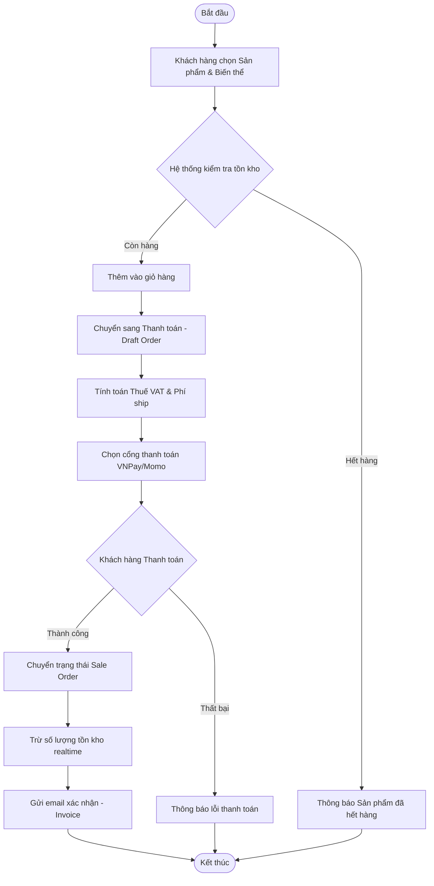

# Tài liệu Đặc tả Yêu cầu (SRS) - Hệ thống E-Commerce Kochi Lens
**Chức năng:** [2.1] Quản lý Sản phẩm (PIM)  
**Sinh viên thực hiện:** Ngô Đức Dũng - 23810310264  
**Ngày thực hiện:** 27/03/2026  

---

## Phần 1: Mô hình hóa quy trình (Business Flow)

### 1. Sơ đồ Use Case (Các tác nhân và chức năng)

2. Sơ đồ luồng hoạt động (Activity Diagram - Luồng đặt hàng)

Phần 2: Đặc tả chức năng (Functional Requirements)
US01: Là một Admin, tôi muốn tạo các biến thể sản phẩm (màu sắc, kích thước) để khách hàng dễ lựa chọn.

US02: Là một Admin, tôi muốn gán mã SKU và Barcode riêng cho từng biến thể để quản lý kho chính xác.

US03: Là một Khách hàng, tôi muốn xem tồn kho realtime của từng biến thể để biết tình trạng hàng.

US04: Là một Nhân viên kho, tôi muốn hệ thống tự trừ tồn kho sau khi có đơn thanh toán thành công.

US05: Là một Admin, tôi muốn thiết lập Thuế VAT mặc định để tự động tính tiền lúc thanh toán.

Phần 3: Đặc tả dữ liệu (Data Schema)
1. Bảng Partner (Khách hàng)

partner_id: Mã khách hàng (PK).

type: B2B / B2C / Guest.

full_name: Tên khách/công ty.

tax_code: Mã số thuế.

delivery_address: Địa chỉ giao hàng.

2. Bảng Product (PIM)

product_id: Mã sản phẩm (PK).

product_name: Tên sản phẩm.

variant_color / variant_size: Màu sắc / Kích thước.

sku / barcode: Mã lưu kho / Mã vạch.

selling_price: Giá bán.

vat_tax: Thuế VAT.

stock_quantity: Số lượng tồn kho.

3. Bảng Order (OMS)

order_id: Mã đơn hàng (PK).

partner_id: Mã khách hàng (FK).

status: Draft, Confirmed, Delivery, Cancelled.

subtotal / shipping_fee / total_tax: Tiền hàng / Phí ship / Thuế.

grand_total: Tổng thanh toán.
